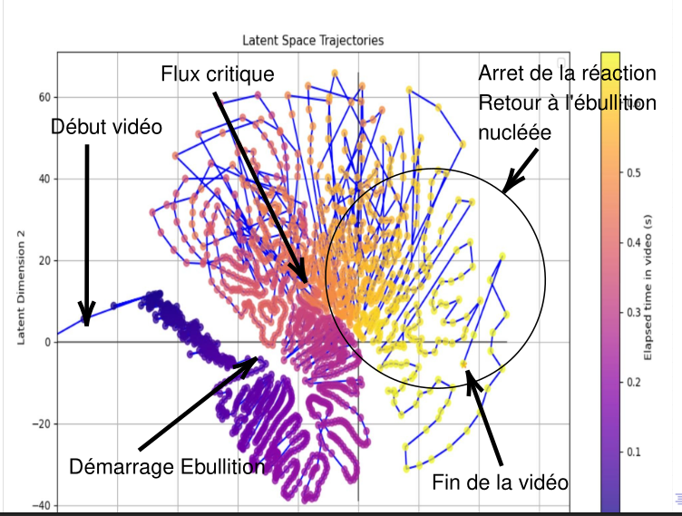

# Study-of-boiling-mechanisms-by-machine-Learning-applied-to-infrared-videos
My fluid mechanics degree internship works at CEA tackles the study of boiling mechanisms by machine Learning applied to infrared videos Application to experimental reactors.

Following an accidental insertion of radioactivity within an experimental reactor, a violent heat flux transmitted from the fuel to its surrounding water occurs. This flux can imply undesired behaviors potentially leading to the establishment of a steam layer surrounding the fuel. The established dynamic can farther cause the melt of the fuel, that is when a threshold flux so called critical heat flux is exceded.
The file `MatarLudovicPresentationStage.pdf` contains the presentation slides of my internship defense.
Works allowed to justify the establishment of auto-similarity equation concerning the critical heat flux (CHF).

